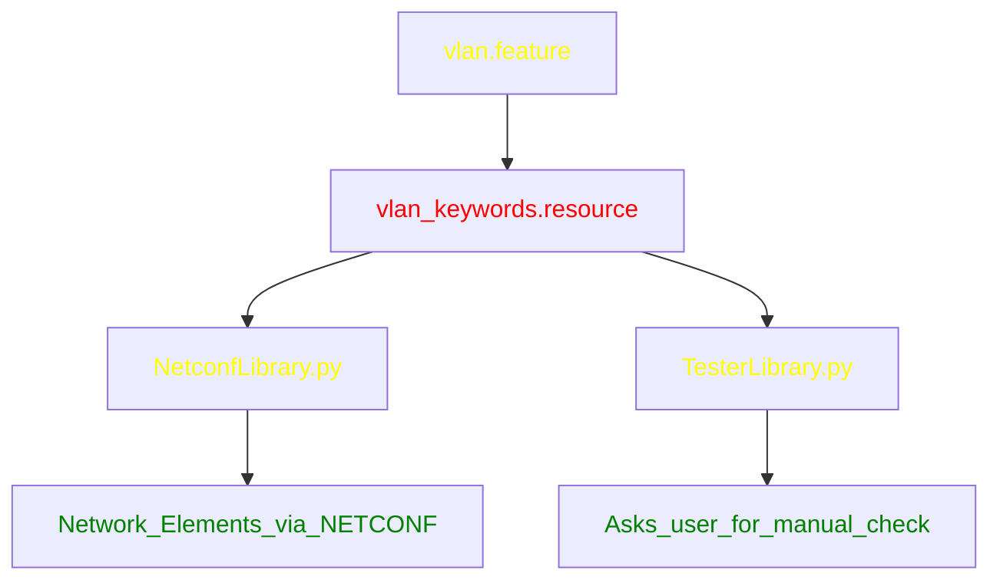

# ETSI 5th mWT Plugtest

Automated Testsuite for ETSI 5th mWT Plugtest using Robot Framework Gherkin Parser.

## Installation instructions

```sh
pip install robotframework-gherkin-parser
```

## Execute the test suite

```sh
robot --parser GherkinParser features/
```
Robot

## Explainations

The file `features/vlan.feature` follows the
[Gherkin language](https://cucumber.io/docs/gherkin/reference).
It reads like plain English sentences and each `Scenario` is a single test.
The test suite currently contains only 5 tests and does not actually connects
to network elements via NETCONF.

The list of network elements are in `network.csv`.


